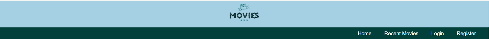
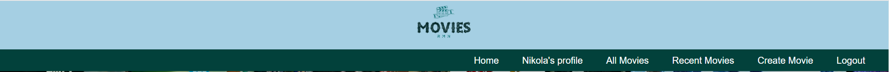

# Movies RMN

Movies RMN is a web application using Angular as a frontend framework. This Single Page Application dedicated to movies.
People can visit it and check the newsest movies, however they can also bookmark them and even create new movies themselves!
The backend which is being used is the SoftUni Rest-api which had been modified(new models, controllers, routes and etc.)
The data is being preserved in MongoDB.

## Steps for local instalation and review:
1. Navigate to Rest-api folder:
   - npm install - command for install all packeges dependances;
   - mpm start - command for install allcommand to start the back-en server;
2. Navigate to Movies-SPA folder:
   - npm install - command for install all install all packeges dependances;
   - Run client Angular app - ng serve --open   or  ng s

## Overview 
### Every page contains navigation
 - NON logged in user
 
 

 - logged in user 

### Every page contains footer

### Home page
Home Page is public for all users.
It has an about us button that shows a short information about the website.
This information is shown with Angular Animation fade-in and fade-out. 

### Login page

The login form requires email and password

 From Validators
 -	Email is the right format(regex is used in the template driven form).
 -	Email should be at least 4 characters.
 -  Password must be 5 characters long and no whitespace is allowed. This is checked with regex pattern in the form.
 -  If a user enter an invalid email or password, an error "Wrong email or password" is being shown.
 This error is caught from the backend. 

### Register page

The register form requires username, email, password and repeat password.

From Validators
 - 	Username should be at least 3 characters.
 - 	Same email validators as in login page are implied here.
 - 	Same password validators as in login page are implied here.
 -	Repeat password and password must match.
 -  If there is already an user with the same email an error will be shown "This email is already registered!" this error 
 is caught from the backend.

### DEMO USERS

  - heypls25@gmail.com  pass: 123456;
  - ivana011@gmail.com  pass: 123456;
  - pepa@gmail.com      pass: 123456;

### Add new movie page
This page is accessible only by logged in users.

The new movie form expects as input: titile, description, imageUrl, genre and release date.
Validators:
 -	Title - should be at least 3 characters.
 - 	Description - should be at least 15 characters.
 -  Image Url - should be at least 10 characters and also validator (regex pattern) is implied.
 -  Genre should be at least 2 characters long.
 -  Date does not allow whitespace.
The "Post Theme" button should be disabled if the inputs are NOT valid.

### Profile page
Page only for logged in users
Profile page contains:
 -  Information about the user such as their email and username.
 -  List with the movies that they've bookmarked. The user can remove the bookmarked movies from their list if wanted and also there 
 is a read more button that will navigate the user to the details page of the certain movie.

## All Movies Page
Page only for logged in users

 - The page contains all the movies.

 ## Recent Movies Page
 For both logged in and non logged in user with difference in the buttons availabe.

 This page filter the movies based on their relase date and shows the top 10 newest movies.

 1. non logged in user
 - When the user is not logged in they can see only the top 10 newest movies without an access to the movies' detials pages.
 There is a paragraph asking the user if they wanna see more and thus and a tag next to it that navigates the user to register page 
 so they can log in and experince the application at its fullest. 

 2. logged in user
 - When the user is logged in they can experince evrything that the non logged in user can however they do not see the paragraph and 
 sign up a tag but instead a "Read more" button that navigates them to the movie's details page.

### Movie deatails page
The page there are two parts - public and private(for logged in users).
1. Public part: 
 - all users can see post text, date of create, poster user and numbers of likes, but not to like, edit, delete post or to add a new comment.
   

2. Private part - only for logged in users:
   - Can posts a new comment;
   - Can likes every comment. If it already liked the post, there are a message "Already liked";
   - If the user is owner of post, it sees edit and delete buttons.

#### Theme deatails - delete post

#### Theme deatails - edit post

